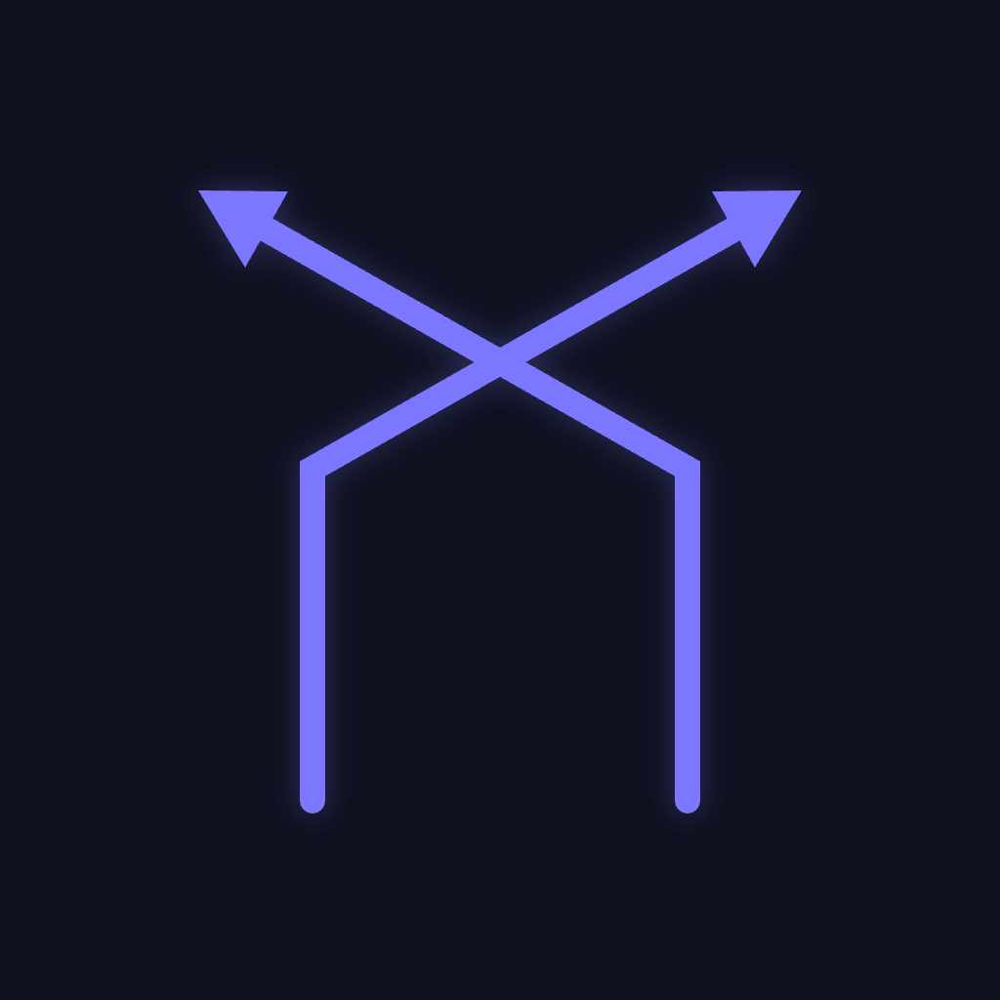
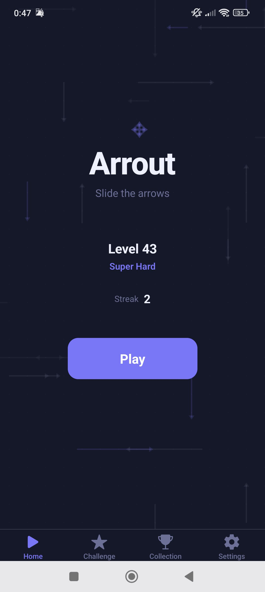
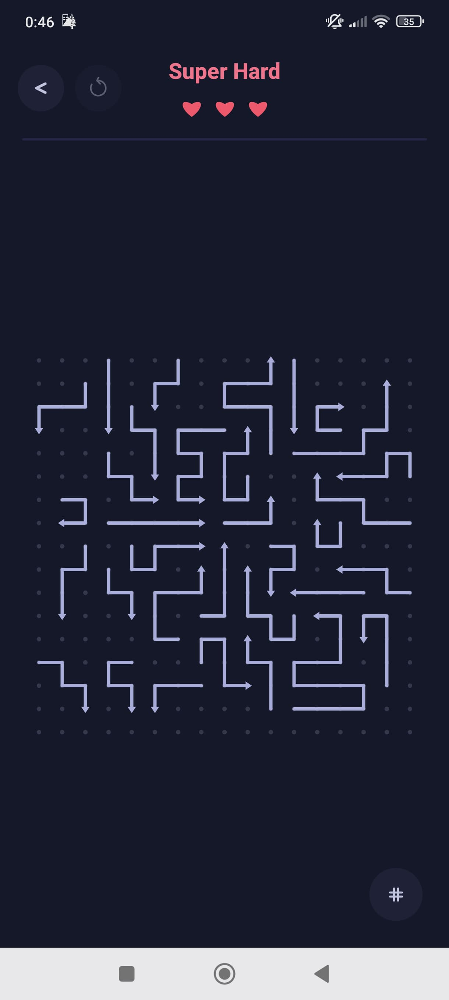

<p align="center">
  
</p>

<h1 align="center">Arrout</h1>

<p align="center">
  A minimalist logic puzzle game for mobile. Slide arrows off the board in the right order — but watch out, they move like snakes.
</p>

<table align="center">
  <tr>
    <td align="center"></td>
    <td align="center"></td>
    <td align="center"><video src="https://github.com/user-attachments/assets/d66b4d56-3496-4948-8184-66ec64d784f0" width="270" controls></video></td>
  </tr>
  <tr>
    <td align="center"><em>Home</em></td>
    <td align="center"><em>Super Hard level</em></td>
    <td align="center"><em>Gameplay</em></td>
  </tr>
</table>

## How It Works

Players are presented with a grid of arrow-shaped pieces. Each arrow has a head pointing in a direction and a body made of straight and curved segments. Tap an arrow to slide it off the board — the head advances and the body follows, cell by cell, like a snake. The catch: arrows block each other. Figure out the right order to clear them all.

- **3 hearts per level** — lose one each time you tap a blocked arrow
- **Undo and restart** available at any time
- **Hints** highlight the next recommended move
- **Daily challenges** with a unique puzzle each day
- **Infinite levels** via procedural generation

## Difficulty Levels

| Difficulty | Grid | Arrows | Curves |
| - | - | - | - |
| Easy | 6x6 | 6 | 20% |
| Medium | 9x9 | 12 | 40% |
| Hard | 13x13 | 20 | 60% |
| Super Hard | 18x18 | 40 | 70% |

## Tech Stack

| Concern | Choice |
| - | - |
| Framework | React Native (Expo SDK 55) |
| Language | TypeScript (strict) |
| Rendering | React Native Skia |
| Animation | React Native Reanimated |
| State | Zustand (persisted with AsyncStorage) |
| Navigation | Expo Router |
| Linting | Biome |
| Runtime & Tests | Bun |

## Architecture

The codebase follows a strict layered architecture where dependencies only flow downward:

```
app/                    Screens & routing (Expo Router)
  src/components/       React Native + Skia UI
    src/hooks/          Bridge between store and UI
      src/store/        Zustand state management
        src/engine/     Pure TypeScript game logic
        src/generator/  Procedural level generation
```

The **engine** and **generator** are pure TypeScript with zero React/RN dependencies — fully testable with `bun test` alone.

### Key design decisions

- **Immutable game state** — all engine functions return new objects, never mutate
- **Single Skia canvas** — the entire grid is one `<Canvas>`, not per-cell Views, critical for performance on 18x18 grids
- **Deterministic generation** — same seed + difficulty = same level, using a seedable PRNG and reverse construction algorithm
- **Two-phase animation** — the store resolves the move immediately (optimistic state), while the visual animation plays asynchronously

## Getting Started

```bash
bun install              # install dependencies
bun start                # start Expo dev server (press i/a/w)
bun test                 # run tests
bun run lint             # lint with Biome
bun run typecheck        # type-check with tsc
```

## License

All rights reserved.
